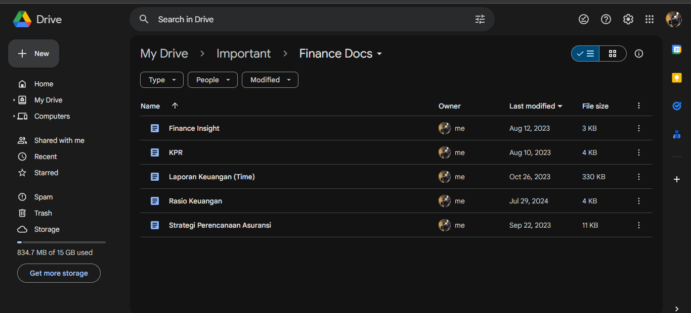

# Convert Documents Automatically with Google Platform.

Program ini membuat kode JavaScript untuk mengonversi file google docs menjadi pdf secara otomatis menggunakan Apps Script dengan beberapa skenario.
* Mengonversi satu file docs menjadi pdf
* Mengonversi semua file yang ada di dalam sebuah folder menjadi pdf disimpan di dalam folder yang sama
* Mengonversi semua file yang ada di dalam sebuah folder menjadi pdf disimpan di dalam folder yang berbeda

